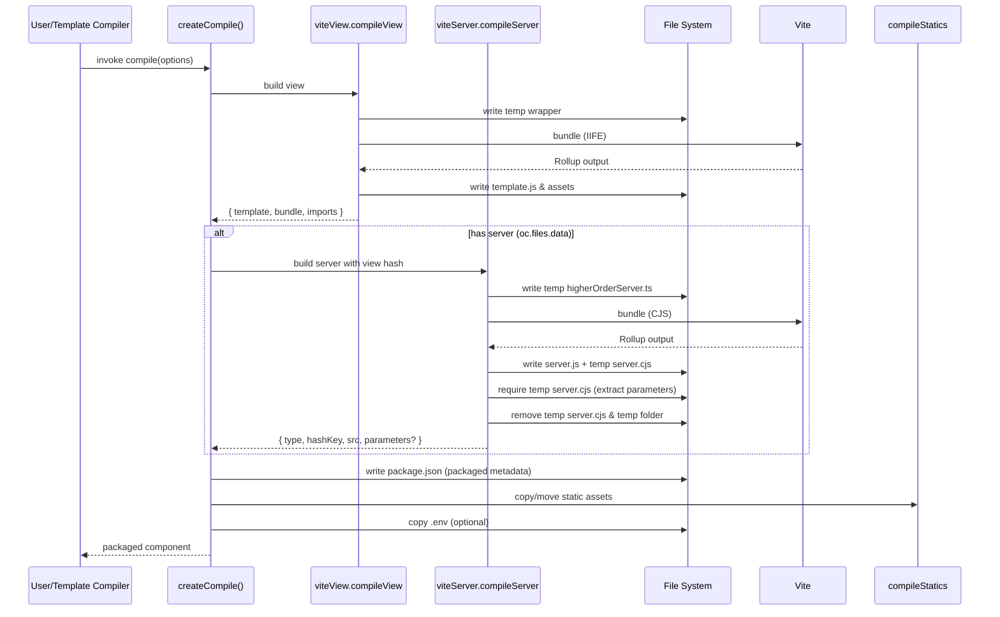
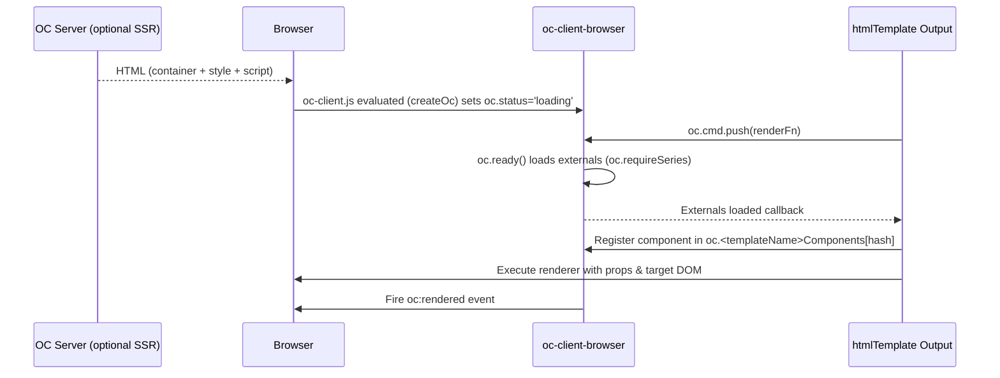

# OC Vite Compiler – Technical Architecture & Build Pipeline

This document provides an in‑depth, implementation‑level explanation of how `oc-vite-compiler` turns an OpenComponents (OC) component source folder into a distributable, packaged OC component. It focuses on the three core modules:

- `createCompile.ts` – Orchestrates the end‑to‑end compilation workflow and emits the packaged `package.json`.
- `viteView.ts` – Builds the client (template) bundle (the view) using Vite + Rollup in IIFE format and wraps it for OC runtime consumption.
- `viteServer.ts` – Builds the server/data provider bundle (if present) in CommonJS format with controlled externals.

An example template-specific entry (`packages/oc-template-react-compiler/src/lib/compile.ts`) shows how a template package wires in template‑specific plugins and wrappers.

---

## 1. High-Level Flow

When a component is compiled, the exported `compile` function (created by `createCompile`) executes the following ordered steps:

1. View Compilation (`compileView` from `viteView.ts`).
2. (Optional) Server/Data Provider Compilation (`compileServer` from `viteServer.ts`) if `oc.files.data` exists.
3. Metadata & Manifest Finalization (rewrite `package.json` with embedded OC metadata, timestamps, versions, hashes, imports).
4. Static Assets Handling (`compileStatics`, provided externally – not shown in the attached files).
5. Environment File Copy (if `oc.files.env` is configured).

The result is a publish folder containing:

```
publishPath/
  package.json        (rewritten & normalized OC metadata)
  template.js         (client/template bundle – name configurable)
  server.js           (server/data provider bundle – if present)
  <staticFolder>/*    (copied & emitted assets, CSS, etc.)
  .env                (optional)
```

---

## 2. `createCompile.ts` – Orchestration Details

### Responsibilities

- Converts callback‑style compile functions (`compileView`, `compileServer`, `compileStatics`) into promises.
- Mutates a cloned copy of the component's `package.json` (to avoid altering the original source file in place) to reflect compiled output.
- Writes the final `package.json` into `publishPath` with normalized fields.
- Handles data provider parameter extraction merging.
- Ensures static folder(s) configuration normalization (`string` → `string[]`).
- Timestamps the build (`oc.date`) using a UTC millisecond timestamp.

### Key Mutations to `componentPackage.oc`:

| Field                | Source                                        | Meaning                                                                                |
| -------------------- | --------------------------------------------- | -------------------------------------------------------------------------------------- |
| `files.template`     | From `compileView` return value               | Includes `{ type, hashKey, src }` + added `version` & `minOcVersion` from `getInfo()`. |
| `files.imports`      | From `compileView` (if set)                   | Arbitrary import map (e.g., dynamic imports support). Currently can be `undefined`.    |
| `files.dataProvider` | From `compileServer` return value             | Replaces original `files.data` once compiled.                                          |
| `parameters`         | Extracted runtime server `_parameters` export | Overrides existing `package.json` parameters with a warning if both defined.           |
| `version`            | From `ocPackage.version`                      | Version of the OC framework/container.                                                 |
| `packaged`           | Set `true`                                    | Declares this is a compiled artifact.                                                  |
| `date`               | Generated UTC timestamp                       | Build reproducibility / metadata.                                                      |

### Parameter Extraction Logic

`viteServer.ts` (see §4) temporarily writes a `server.cjs` file, requires it, inspects `server._parameters`, then deletes it. If `_parameters` is non‑empty, it becomes `componentPackage.oc.parameters` (overriding any explicitly set `parameters` in the original `package.json` with a warning).

### Error Propagation

All steps run inside an async function; thrown errors are caught and passed to the original callback in Node-style `(err, data)` signature.

### Idempotence & Side Effects

The source `package.json` is **not** modified. Only the published copy is emitted/overwritten at `publishPath/package.json`.

---

## 3. `viteView.ts` – Client/View Compilation

### Purpose

Produces an IIFE bundle (`template.js` by default) that:

- Wraps the original component view (React/Preact/Vue/etc. depending on template) behind an OC runtime wrapper.
- Embeds an OC HTML template (via `htmlTemplate()` or user override) with hashing for cache busting.
- Inlines or rewrites asset references for the OC's static path resolution system.

### Inputs (from `CompilerOptions` & `ViteViewOptions`)

- `componentPackage.oc.files.template.src` – The source view entry file (e.g., `src/template.jsx`).
- `componentPackage.oc.files.static` – Static folder(s) (used to write additional assets like CSS, images emitted by Rollup).
- `externals` – Optionally provided as globals or ESM externals to prevent bundling.
- `plugins` – Vite plugin list (template-specific enhancements like React JSX transform, CSS modules, etc.).
- `viewWrapper` – Optional function that wraps the view entry (default is a simple function that renders into an element's `innerHTML`).
- `htmlTemplate` – Function building the low-level HTML string inserted into the runtime wrapper.
- `production` flag – Controls minification & removal of dev console proxy instrumentation.

### Core Steps

1. **Static Folder Normalization**: Derives a normalized `staticFolder` (first entry when an array; trims leading/trailing slashes).
2. **View Wrapper Generation**: Writes a temporary `_viewWrapperEntry.(js|jsx|ts|tsx)` that imports the real view and exposes a standard entry contract for bundling.
3. **Global External Mapping**:
   - Builds a `globals` object mapping module IDs (and optional deep paths) to global variable names (UMD/IIFE style).
   - These appear in Rollup output config as `output.globals`.
4. **Base Config Plugin Merging**:
   - Loads any user Vite config in `process.cwd()` and filters out duplicates of user-specified plugin names to avoid duplication.
5. **Wrapper Plugin (`WrapEntry`)**:
   - Executes post-bundle.
   - Aggregates emitted CSS assets (concatenates and strips newlines/tabs/single quotes for injection).
   - Collects and defers other non-CSS assets in `otherAssets` for emission into the static folder.
   - Generates an IIFE that returns the `clientBundle` object.
   - Computes a `hash` via `oc-hash-builder` over the IIFE source.
   - Produces an OC template function string via `htmlTemplate` (inserting CSS, externals, hash, and inlined JS bundle string) and wraps it with the `oc-view-wrapper` higher-order wrapper (`ocViewWrapper`).
   - Replaces the main chunk code with the final OC wrapper output.
6. **Runtime Console Proxy (Dev Mode)**:
   - Injected only when `production === false`.
   - Monkey-patches `console.log` & `console.error` in the rendered page to forward log content back to the OC server via a special action ID `$$__oc__server___console__$$` using `window.oc.getAction` (if available).
7. **`renderBuiltUrl` Experimental Hook**:
   - For JS host types, rewrites dynamic asset references to call `__toOcStaticPathUrl(filename)` at runtime.
   - This ensures static asset URLs are resolved relative to the OC's `_staticPath` rather than a hard-coded path.
8. **Writing Outputs**:
   - `template.js` (or configured `publishFileName`) is written to `publishPath`.
   - Additional emitted assets (excluding CSS, which is inlined) are placed under the `staticFolder` path preserving nested directories (e.g., `assets/img/logo.svg`).

### Hash Semantics

- The computed `hash` becomes both `template.hashKey` and `bundle.hashKey` in the returned object (deduplicated since they are derived from the same IIFE payload after wrapping).
- This hash drives OC cache invalidation for client bundles.

### Manipulation of `oc-server` Runtime Source

Two targeted source transforms occur via a plugin named `OcServerRuntime`:

| Target File (Substring Match)                 | Transformation                                                                                                                |
| --------------------------------------------- | ----------------------------------------------------------------------------------------------------------------------------- |
| `node_modules/oc-server/dist/serverClient.js` | Replaces placeholder `"COMPONENT_NAME"` & `"COMPONENT_VERSION"` with actual values to bake metadata into runtime client code. |
| `node_modules/oc-server/dist/Server.js`       | Replaces `"__INITIAL__DATA__"` sentinel with an empty object `'{}'` to reset initial data injection.                          |

### Externals Handling

- Global externals (with a `global`) are omitted from the bundle and referenced via the global variable.
- ESM externals (without a `global`) are marked external but not given a browser global mapping (assumes runtime loader will handle them).

### Provider Functions Injection

`providerFunctions` (imported from `./providerFunctions`) is passed into the `viewWrapperFn` though its details are not provided here. It likely injects runtime scaffolding (e.g., hydration, mounting, or state bridging). The wrapper content is fully under user control via the `viewWrapper` option.

### Edge Cases & Defensive Behaviors

- Windows path escaping: All Windows backslashes are doubled to avoid escape issues in generated code.
- Source maps disabled intentionally (`sourcemap: false`) because the final wrapping shifts line numbers making direct maps unreliable.
- If the main output chunk is not of type `chunk`, compilation throws to catch unexpected bundler output.

---

## 4. `viteServer.ts` – Server/Data Provider Compilation

### Purpose

Builds the Node.js server (data provider) entry into a CommonJS bundle (`server.js`) that exports the component's `data` logic in a standard OC runtime form and attaches metadata such as a hash key and parameters.

### Inputs (from `CompilerServerOptions` & `ViteServerOptions`)

- `componentPackage.oc.files.data` – Path to the original server entry file.
- `compiledViewInfo.bundle.hashKey` – Injected into the server wrapper to correlate view & server versions.
- `plugins` – Additional Vite plugins (typically same or subset used for view compilation, but not required).
- `imports` (optional) – Additional import resolution mapping (currently unused directly in the provided code – future extension point).
- `serverWrapper` – Optional function to produce a higher-order server module source.

### Core Steps

1. **Server Entry Path Resolution**: Joins component path with declared server file. On Windows, backslashes are escaped for safe embedding.
2. **Export Introspection**:
   - Uses `es-module-lexer` (`init` then `parse`) to statically analyze the server entry for named exports.
   - These export names are passed to `serverWrapper` for dynamic wrapper code generation.
3. **Higher-Order Wrapper Generation**:
   - `serverWrapper` (or default) returns full TypeScript/JavaScript text which becomes the actual build entry (`__oc_higherOrderServer.ts`).
   - Carries fields: `exports`, `bundleHashKey`, `serverPath`, `production`, `componentName`, `componentVersion`, `esm` (bool if template type is `oc-template-esm`).
4. **Externals Resolution**:
   - Build-time `external()` function enforces that any top-level bare import (matching `/^[a-z@][a-z\-/0-9.]+$/i`) must exist in `dependencies` or be a core Node module; otherwise, compilation fails explicitly with `Missing dependencies from package.json => <id>`.
   - Path-qualified module specifiers (`foo/bar`) are reduced to the root package name `foo` for dependency existence check.
   - `oc-server` is forcibly included (`external` returns `false`).
5. **Build Invocation**:
   - Vite lib build with format `cjs`, `write: false` (in-memory), minified in production.
   - Merges user plugins with `basePlugins` (deduplicated by name) from any root Vite config.
6. **Bundle Extraction**:
   - First output chunk's `code` is used as server bundle content.
7. **Dual Write**:
   - Writes both `server.js` (configured `publishFileName`) and a temporary `server.cjs` copy for runtime parameter extraction.
8. **Parameter Extraction**:
   - `require()`s the temporary `server.cjs`.
   - If `server._parameters` has keys, sets `parameters` in returned metadata (and triggers override warning if original `package.json` already had parameters – warning message printed with yellow ANSI color).
   - Deletes `server.cjs` afterwards.
9. **Hash Key Generation**:
   - Hash of the server bundle string via `oc-hash-builder` → `hashKey` (distinct from the view hash; server content differs).
10. **Cleanup**:
    - Removes the temporary wrapper folder (`temp`).

### Returned Object

```
{
  type: 'node.js',
  hashKey: <hash>,
  src: 'server.js',
  parameters?: { ... } // only if detected
}
```

### Error Handling & Guarantees

- The `external` check intentionally fails fast for missing dependencies to prevent hidden runtime resolution errors in production.
- Temporary artifacts are cleaned in a `finally` block to avoid stale files on failure.

---

## 5. Template Integration Example (`oc-template-react-compiler`)

`packages/oc-template-react-compiler/src/lib/compile.ts`:

```ts
import { getInfo } from 'oc-template-react';
import react from '@vitejs/plugin-react';
import { createCompile } from 'oc-vite-compiler';
import reactOCProviderTemplate from './reactOCProviderTemplate';

export const compile = createCompile({
  plugins: [react() as any],
  viewWrapper: reactOCProviderTemplate,
  getInfo: getInfo as any,
});
```

This wires:

- React plugin (JSX transform, Fast Refresh disabled in build, etc.).
- A React-specific `viewWrapper` to mount the component via React APIs instead of raw `innerHTML`.
- The template's `getInfo()` which provides `version`, `minOcVersion`, `externals` metadata injected into the final packaged `package.json`.

Additional template packages (Preact, Vue, Svelte, Solid, etc.) follow the same pattern with their own plugin stacks and wrappers.

---

## 6. Hashing Strategy & Caching Considerations

| Artifact             | Hash Source                                                | Purpose                                                                                                                         |
| -------------------- | ---------------------------------------------------------- | ------------------------------------------------------------------------------------------------------------------------------- |
| View (`template.js`) | Entire wrapped IIFE (post CSS injection & runtime wrapper) | Ensures any change (view code, CSS, wrapper, externals list, dev instrumentation removal) creates a new hash for cache busting. |
| Server (`server.js`) | Server bundle raw code                                     | Ensures data provider changes invalidate server hash separately.                                                                |

The view's hash is duplicated across `template.hashKey` and `bundle.hashKey` (legacy compatibility or dual use; they are identical here). The server hash is independent.

---

## 7. Externals & Globals Model

### View Side

- Global externals become `external` in Rollup OR are mapped to specific global variables (`window[globalName]`) via `output.globals`.
- ESM externals (those without a `global`) are left unbundled expecting an upstream module loader environment.

### Server Side

- Only Node core modules + declared `dependencies` are allowed. Missing modules produce a hard error to ensure deterministic deployment.
- Dev dependencies are not considered; ensuring runtime dependencies are explicitly declared.

---

## 8. Runtime Data & Parameter Mechanics

- During client rendering, the wrapper function receives `model` whose `component.props` contains OC system props:
  - `_staticPath`, `_baseUrl`, `_componentName`, `_componentVersion`, plus user props.
- The wrapper extracts these, sets up:
  - `__toOcStaticPathUrl()` for asset URL rewriting.
  - Development console proxy (non-production only).
  - Lookup of the target DOM element using `<oc-component data-id="...">` (or custom tag via `window.oc.conf.tag`).
- The `__$$oc_initialData__` variable stores user parameters for potential hydration or debugging.

---

## 9. Windows Path Handling

Paths passed into generated transient entry files escape backslashes by doubling them (`'\\'`) to avoid accidental escape sequences inside string literals in the emitted wrapper code.

---

## 10. Extension Points & Customization Summary

| Extension       | Location                  | Purpose                                                                      |
| --------------- | ------------------------- | ---------------------------------------------------------------------------- |
| `plugins`       | Both view & server builds | Inject additional Vite/Rollup plugins (transpilation, analysis, transforms). |
| `viewWrapper`   | `viteView`                | Override the entry wrapper (e.g., mount React root, hydrate, lazy load).     |
| `serverWrapper` | `viteServer`              | Adjust server runtime scaffolding (e.g., custom export shaping).             |
| `htmlTemplate`  | `viteView`                | Control HTML structure injected into OC runtime wrapper.                     |
| `externals`     | `viteView`                | Declare global or ESM externals to shrink bundle.                            |
| `imports`       | `viteServer` (future)     | Potential mapping for resolving module specifiers or dynamic loading.        |

---

## 11. Sequence Diagram



---

## 12. Failure Modes & Edge Cases

| Area                        | Failure Mode                              | Handling                                                     |
| --------------------------- | ----------------------------------------- | ------------------------------------------------------------ |
| Server externals            | Missing dependency not in `dependencies`  | Throws explicit error, stops build.                          |
| View main chunk expectation | `mainBundleName` mismatch or not a chunk  | Throws error.                                                |
| Asset writing               | Nested asset paths (e.g., `assets/x.png`) | Ensures directories via `fs.ensureFile`.                     |
| Parameter extraction        | Require fails (syntax/runtime)            | Silently caught; parameters remain undefined.                |
| Windows paths               | Backslash escaping omitted                | Would break import string literals – code accounts for this. |
| Duplicate plugins           | User duplicates base config plugin        | Filtered out by name.                                        |

---

## 13. Potential Improvement Areas / Open Questions

1. `imports` in `CompiledViewInfo` & `compileServer` options currently appear unused by `viteServer.ts`; confirm intended future use (dynamic import maps?).
2. Source maps for view are disabled due to wrapper line shifting; could generate & remap via a post-processing step (e.g., `combine-source-map`). Desired?
3. Dev console forwarding logs both `log` and `error`; should `warn` or others be included? Configurable?
4. Duplicate hash fields (`template.hashKey` & `bundle.hashKey`) – legacy requirement or can they be collapsed?
5. Parameter extraction uses CommonJS `require`; if server bundle becomes ESM-only, this logic needs adaptation (dynamic import & temporary file extension change?).
6. Are there constraints on `otherAssets` types beyond non-CSS? (Binary assets vs. text encoding detection currently relies on treating `source` as `utf-8` string.)

Feel free to clarify these points if deeper documentation is desired.

---

## 14. Quick Reference – Returned Structures

### From `compileView`:

```ts
{
  template: { type: string; hashKey: string; src: string },
  bundle: { hashKey: string },
  imports?: Record<string,string>
}
```

### From `compileServer`:

```ts
{
  type: 'node.js',
  hashKey: string,
  src: string, // e.g., 'server.js'
  parameters?: Record<string, unknown>
}
```

### Final `package.json` OC Fields (simplified):

```ts
oc: {
  version: string,
  packaged: true,
  date: number, // ms UTC
  parameters?: Record<string, unknown>,
  files: {
    template: { src: string; type: string; version: string; minOcVersion?: string; hashKey: string },
    imports?: Record<string,string>,
    dataProvider?: { type: 'node.js'; src: string; hashKey: string },
    static: string[],
    env?: string // (original spec only; final build copies to .env)
  }
}
```

---

## 15. Minimal Usage Pattern

```ts
import { createCompile } from 'oc-vite-compiler';
import react from '@vitejs/plugin-react';

const compile = createCompile({
  compileView: /* provided internally */,
  compileServer: /* provided internally */,
  compileStatics: /* provided externally by template infra */,
  getInfo: () => ({ type: 'oc-template-react', version: 'x.y.z', externals: [] })
});

compile({
  componentPackage, // parsed package.json
  componentPath,    // absolute component root
  publishPath,      // output dir
  minify: true,
  production: true,
  ocPackage,        // oc framework package.json
  verbose: false,
  watch: false
}, (err, result) => { /* ... */ });
```

---

## 16. Summary

`oc-vite-compiler` provides a deterministic, hash-driven bundling pipeline integrating Vite/Rollup with OC-specific runtime contracts. The system emphasizes:

- Explicit dependency management (server side).
- Configurable view/runtime wrapping.
- Hash-based cache busting.
- Parameter introspection from server code.
- Controlled externalization with global injection support.
- Cross-platform path safety.

Please provide any clarifications for the open questions (§13) to refine this documentation further.

---

© OpenComponents – Compiler internals documentation.

---

## 17. `oc-server` Runtime Integration

This section explains how the compiler interacts with the `oc-server` package (see `packages/oc-server/src/Server.ts`) and how user server code (e.g. `entry.server.ts` in template scaffolds) is transformed and executed at runtime once compiled by `viteServer.ts`.

### 17.1 Authoring Pattern (User Land)

Example (`entry.server.ts`):

```ts
import { Server } from 'oc-server';

export const server = new Server({
  development: { console: true },
})
  .withParameters({
    userId: {
      default: 1,
      description: 'The user id from the user database',
      example: 1,
      mandatory: true,
      type: 'number',
    },
  })
  .handler(async (params, ctx) => {
    // initial data provider logic
    return { firstName: 'John', lastName: 'Doe' };
  })
  .action('funFact', async ({ year }) => ({ funFact: '...' }));

// Module augmentation for type inference
declare module 'oc-server' {
  interface Register {
    server: typeof server;
  }
}
```

Key fluent API calls:

| Method                              | Purpose                                                                                                                                                                                      |
| ----------------------------------- | -------------------------------------------------------------------------------------------------------------------------------------------------------------------------------------------- |
| `new Server(options)`               | Instantiate typed builder. Options: `stream`, `development.console`.                                                                                                                         |
| `.withParameters(schema)`           | Declare strongly typed URL/query parameters + metadata (description/example/default/mandatory). Stored internally in `_parameters`.                                                          |
| `.middleware(fn)`                   | (Optional) Pre-processor; output stored as `context.state` for subsequent handler/action calls.                                                                                              |
| `.handler(fn)`                      | Defines the primary initial data provider (called when no `action` field is present). Returns data passed to client template as initial props. Returning `undefined` can suppress rendering. |
| `.action(name, fn)`                 | Register named server-side action callable from the client via OC action API.                                                                                                                |
| `.defineEnv()` / `.definePlugins()` | Type-shaping utilities altering generic parameters; ensure environment or plugin shape is known to subsequent steps (they prune chain methods to enforce order).                             |

### 17.2 Internal Representation (`Server.ts`)

Creation flow (simplified):

1. `Server` collects configuration (`middleware`, `_parameters`, `development.console`).
2. Calling `.handler()` returns a `HandledServer` instance which materializes:
   - `initial`: the main handler function.
   - `actions`: a dictionary of user-defined actions.
   - Dev console action injection (if `development.console` enabled) registering the special internal action name `"$$__oc__server___console__$$"`.
3. Client-side console proxy (inserted by `viteView.ts` in non-production builds) invokes this hidden action to forward `console.log/error` from browser → server terminal.

### 17.3 Parameter Extraction During Compilation

During server compilation, `viteServer.ts` requires the transient `server.cjs` bundle, reads `server._parameters` (private field populated by `.withParameters()`), and if non-empty sets `componentPackage.oc.parameters`. This ensures final published metadata includes runtime-validated parameter schema.

Conflict rule: if original `package.json` also contained `oc.parameters`, the server-derived schema overrides it and a warning is emitted (yellow ANSI) encouraging removal of the stale definition.

### 17.4 Data Provider Function (`getData`)

`HandledServer.getData()` returns a Node-style callback function `(context, cb)` with signature expected by the classic OC runtime. Flow:

1. Middleware (if present) runs first; its return value becomes `context.state`.
2. If `context.action` is set and matches a registered action name, that action executes with params (preferring `params.data` if present – enabling forms that wrap payload under `data`).
3. Otherwise the `initial` handler runs.
4. Streaming flag: if the server was created with `stream: true` and the context includes `streamSymbol`, the resulting object is annotated with that symbol (used for streaming responses – outside scope of provided code but supported by contract).
5. Callback invoked as `cb(null, result, { console: <bool> })`, where the third arg flags whether dev console piping is active.

### 17.5 Type Inference & Module Augmentation

The `declare module 'oc-server' { interface Register { server: typeof server } }` pattern lets the library infer:

- `InitialData` (serialized and exposed client-side via `getInitialData()`).
- `HandlerParameters` (exposed for TS tooling / templates to know parameter types).
  This is powered by conditional & mapped types in `Server.ts` (e.g., `TransformOcParameters`, `GetHandlerParameters`, `GetInitialData`).

### 17.6 Client Runtime Globals Injected by the View Wrapper

`viteView.ts`’s wrapper produces:

| Global / Identifier    | Source                                                                                    | Purpose                                        |
| ---------------------- | ----------------------------------------------------------------------------------------- | ---------------------------------------------- |
| `__$$oc_initialData__` | Serialized result of initial handler                                                      | Returned by `getInitialData()` in `oc-server`. |
| `__$$oc_Settings__`    | Constructed from OC wrapper (`id`, `element`, `staticPath`, `baseUrl`, `name`, `version`) | Returned by `getSettings()`.                   |

The transform plugin rewrites placeholders inside `oc-server` distribution files so these globals supply component identity metadata without additional runtime negotiation.

### 17.7 Development Console Bridge

Pieces involved:

1. Author enables `development.console: true` when instantiating `Server`.
2. `HandledServer` injects special action `$$__oc__server___console__$$` that prints messages prefixed with a gray `[browser]` tag (ANSI 90).
3. View wrapper (non-production) monkey-patches `console.log` and `console.error` in the browser; each call triggers `window.oc.getAction({ action: '$$__oc__server___console__$$', ... })` with `{ message, level }`.
4. On the server side the action is executed like any other, printing the message in the terminal; this gives developers full visibility during local dev without building bespoke logging bridges.

### 17.8 Action Invocation from Client

While not fully shown in supplied code, the client OC runtime typically exposes an API (e.g., `window.oc.getAction`) that constructs a request with:

```
{ action: <actionName>, parameters: { ... }, baseUrl, component, version }
```

The server bundle’s exported data provider interprets `context.action` and dispatches to the matching `actions[name]` function. This decouples client lifecycle (initial render vs user interaction) while sharing the same parameter validation and middleware pipeline.

### 17.9 Streaming Mode

If `new Server({ stream: true })` is used:

- Returned payloads get tagged with a special symbol (looked up via `context.streamSymbol`).
- Downstream OC infrastructure can detect and treat the response as a stream or progressive payload (implementation outside excerpts but supported by contract).
- The compiler itself is agnostic; it merely preserves the code path and does not strip streaming logic in minification.

### 17.10 Relationship Summary (Compiler ↔ oc-server)

| Concern                           | Handled By                                               | Interaction                                                                                       |
| --------------------------------- | -------------------------------------------------------- | ------------------------------------------------------------------------------------------------- |
| Parameter schema capture          | `Server.withParameters` + compiler parameter extraction  | Compiler loads compiled server bundle → reads `_parameters` → writes to published `package.json`. |
| Dev console piping                | `Server` injecting action + view wrapper instrumentation | Compiler’s view wrapper inserts browser patch; server auto-registers action.                      |
| Component identity (name/version) | Transform plugin in `viteView.ts`                        | Replaces placeholders in distributed `oc-server` runtime files.                                   |
| Initial data & settings exposure  | `Server.ts` globals + wrapper                            | Wrapper defines globals; `oc-server` exports `getInitialData` / `getSettings`.                    |
| Actions and middleware            | User code + `HandledServer.getData()`                    | Compiler bundles code unchanged except for wrapper/hashing.                                       |
| Streaming flag                    | `ServerOptions.stream`                                   | Passed through runtime; compiler is transparent.                                                  |

### 17.11 Why CJS for Server Bundle?

`viteServer.ts` forces `cjs` output (`formats: ['cjs']`) so the compiler can synchronously `require()` the temporary bundle for parameter extraction without spinning an async ESM loader. This simplifies build-time introspection. If future migration to ESM is desired, the parameter extraction step must switch to dynamic `import()` and the build would emit `esm` plus maybe a conditional export map.

### 17.12 Safety & Determinism

- Fast failure on undeclared dependencies ensures reproducible deployments.
- Controlled code injection (only replacing explicit placeholders) keeps the surface minimal and auditable.
- Private `_parameters` field is not mutated by compiler—only read—preserving user intent.

### 17.13 Potential Enhancements

1. Allow surfacing validation errors for parameters at compile time by executing a dry-run with default parameter values.
2. Expose an official action name constant for the dev console to avoid string duplication in view wrapper & Server internals.
3. Provide an opt-in source map passthrough for server bundle to aid debugging complex handlers.
4. Extend streaming support with typed progressive payload helpers (e.g., async iterator abstraction) integrated into `HandledServer`.

---

If further deep dives (e.g., into `serverWrapper` implementation details or the action transport layer) are needed, let me know and Section 17 can be expanded.

---

## 18. `oc-server` Dev CLI & HMR Server

The `oc-server` package ships a CLI (`packages/oc-server/src/cli/cli.ts`) exposing a `dev` command that bootstraps a development environment with live-reloading client assets and fast server-side iteration. This section details how the dev server (`cli/server.ts`) operates and how it fits into the compilation model documented earlier.

### 18.1 CLI Entry (`cli.ts`)

Flow:

1. Reads the project's `package.json` via `parsePkg` to detect:

- `templateType` (e.g. `oc-template-react`, `oc-template-vue`, etc.).

2. Dynamically requires the template compiler HMR helper:

- Path pattern: `${templateType}-compiler/dist/lib/hmr`.
- Expected export shape: an object conforming to `Template` interface: `{ appBlock, plugin? }`.
  - `appBlock(opts)` returns HTML string used to inject the component `<script>` tag into the dev page.
  - `plugin()` (optional) returns a Vite plugin enabling template-specific transforms & HMR wiring (e.g., React Refresh or framework hydration helpers).

3. Parses CLI arguments (`--port|-p`, `--help`).
4. Invokes `createServer({ template, port })` for the `dev` command.

Failure Handling:

- If the template HMR module cannot be resolved, CLI prints an error suggesting upgrading and exits with status `1`.

### 18.2 Dev Server Core (`server.ts`)

`createServer` constructs a Fastify-based HTTP server augmented with:

| Concern               | Implementation                                          | Notes                                                                            |
| --------------------- | ------------------------------------------------------- | -------------------------------------------------------------------------------- |
| HTTP framework        | Fastify + `@fastify/express`                            | Express-style middlewares for Vite integration.                                  |
| Client bundler / HMR  | Vite dev server (`middlewareMode: true`)                | Injects HMR websocket, transforms `index.html`, handles module graph.            |
| Server entry bundling | `esbuild.buildSync`                                     | One-off in-memory CJS bundle of `serverEntry`. Not currently watched.            |
| Parameter schema      | Extracted from `server._parameters` (if server present) | Mirrors compilation-time parameter extraction.                                   |
| Client OC runtime     | `oc-client-browser.compileSync()`                       | Provides dev `client.js` served at `/oc-client/client.js`.                       |
| CSS Modules           | `cssModulesPlugin()` imported from `oc-vite-compiler`   | Ensures style scoping parity with production build.                              |
| Template plugin       | `template.plugin?.()`                                   | Adds framework-specific dev/HMR logic.                                           |
| Plugin mocks          | `getMockedPlugins()`                                    | Registers plugin hooks (e.g., for analytics or extension points) in dev context. |

#### 18.2.1 Data Provider Resolution (`getDataProvider`)

Algorithm:

1. If `serverEntry` absent → returns a trivial provider echoing inbound params (`(context) => ({ ...context.params })`).
2. Else, calls `esbuild.buildSync` with:

- `bundle: true`, `format: 'cjs'`, `write: false`.

3. Executes the bundled code inside a fresh VM context (`vm.runInNewContext`) providing an isolated global scope (but inherits `console`).
4. Resolves the effective data provider as either:

- `backend.data` (legacy direct export) OR
- `backend.server.getData()` (preferred fluent API from `Server.ts`).

5. Wraps data provider with a simple promisifier to standardize async usage in route handlers.
6. Extracts `backend.server?._parameters` as `parametersSchema` (similar to compile-time extraction but dynamic in dev).

Observations / Implications:

- Server code changes are **not** auto-rebuilt by esbuild; currently a restart is required for server-side logic changes (potential enhancement: watch and rebuild on file change, or use `esbuild.context` / Vite SSR pipeline for unification).
- Using a VM sandbox prevents module state leakage if a future hot-reload mechanism re-evaluates code; presently only evaluated once.

#### 18.2.2 HTML Template Strategy

Two modes:

| Mode            | Trigger                                                               | Behavior                                                                                          |
| --------------- | --------------------------------------------------------------------- | ------------------------------------------------------------------------------------------------- |
| Custom template | `index.html` (or passed file) exists & valid (must include `</body>`) | Injects OC client loader script if missing and `appBlock` markup before `</body>`.                |
| Fallback        | Missing or invalid template                                           | Generates a base HTML with a minimal style reset and injects import map + OC client + `appBlock`. |

`getHtmlTemplate` ensures the OC client script is present (only injects if `window.oc?.status` is falsy, accommodating manual inclusion). After base assembly, Vite processes it via `transformIndexHtml` to attach HMR runtime and apply plugin HTML transforms.

Import Maps: If root Vite config resolves aliases (`resolve.alias`), these are converted to an `importmap` JSON block enabling bare specifier rewriting in the browser consistent with dev module resolution.

#### 18.2.3 Routes

| Route                  | Method | Purpose                                                                                                      | Response Shape                                                                                    |
| ---------------------- | ------ | ------------------------------------------------------------------------------------------------------------ | ------------------------------------------------------------------------------------------------- |
| `/oc-client/client.js` | GET    | Serves the dev OC client runtime JS (`ocClientBrowser.compileSync().dev`).                                   | Raw JS (text/javascript).                                                                         |
| `/`                    | POST   | Component render API (data / action execution). Consumes body `{ components: [ { action?, parameters } ] }`. | Array of OC-style component responses: `[{ status, response: { data: { component: { props }}}}]`. |
| `*`                    | GET    | Full-page dev HTML with injected component script and initial data.                                          | HTML (text/html).                                                                                 |

POST Flow:

1. Extract `action` & `parameters` from first `components[0]` element.
2. Build request context + plugin response headers via `getContext`.
3. Call `dataProvider(context)` → returns `props`.
4. Assemble OC response envelope (status 200 + data). Headers from plugins applied to Fastify reply.

GET Flow:

1. Compute `params` = `defaultParams` (derived from explicit `oc.parameters` in root package OR dynamic `parametersSchema`).
2. Build context; invoke `dataProvider` to obtain initial data.
3. Inject JSON stringified data into template by replacing `__INITIAL_DATA__` (if present). Note: base template does not define this placeholder; only custom templates can leverage it presently.
4. Run `vite.transformIndexHtml(url, htmlTemplate)` for final transformation (adds HMR client, processes `<script type="module">`, etc.).
5. Send HTML with any plugin-contributed headers.

#### 18.2.4 HMR Mechanics

Client-Side:

- Vite injects its HMR websocket + module update handlers into the transformed HTML.
- The template-specific plugin (e.g., React plugin via `${templateType}-compiler`) is expected to handle re-rendering the component when the view module updates. (Exact logic lives in the template compiler `hmr` module, not covered in current excerpts.)

Server-Side:

- Server code (data provider / actions) is not hot reloaded—requests continue to use the originally evaluated VM bundle until the process restarts. This isolates HMR to **view layer** changes.

Potential Enhancement Ideas:

| Enhancement                              | Approach                                                                                                     |
| ---------------------------------------- | ------------------------------------------------------------------------------------------------------------ |
| Server HMR                               | Use `esbuild.context({ incremental: true })` or leverage Vite SSR plugin pipeline & invalidate module cache. |
| Parameter schema live updates            | Rebuild server bundle & refresh `parametersSchema` on change events (file watcher).                          |
| Initial data placeholder standardization | Always inject a placeholder in base template for consistency.                                                |

| Error boundary strategy: currently relying on Fastify + Vite stack trace fix; consider user-friendly JSON errors for POST route. 5. Potential memory growth if a future server HMR repeatedly rebuilds into new VM contexts – needs disposal strategy.

---

Future documentation can expand with the template HMR module internals once those sources are included.

---

## 19. `htmlTemplate.ts` & `oc-client-browser` Runtime Interplay

This section details how `src/lib/htmlTemplate.ts` produces the per-render HTML+script payload that the OC client (`oc-client-browser/src/oc-client.js`) consumes, and how data flows among: the compiled view bundle, template hash registration, externals loader, and browser-side rendering lifecycle.

### 19.1 `htmlTemplate.ts` Output Contract

`htmlTemplate()` returns a **string of JavaScript code** representing a function of signature:

```js
function(model) { /* returns HTML string */ }
```

This returned function (as text) is later wrapped again inside `viteView.ts` (the wrapper plugin) where it is embedded into a larger OC view wrapper and ultimately assigned to the OC runtime via `ocViewWrapper(hash, wrappedTemplateString)`. The wrapper expects a function accepting a `model` object shaped like:

```ts
{
  id: string;           // runtime-generated component instance id
  component: { props: Record<string,any> };
  __html?: string;      // optional server-side rendered HTML (SSR path)
}
```

### 19.2 Generated Markup Structure

The function body (simplified) performs these steps:

1. Registers the component's client bundle into a template-specific registry:

```js
oc.<templateName>Components = oc.<templateName>Components || {};
oc.<templateName>Components[hash] = (bundleIifeResult);
```

2. Determines whether this is an SSR render:

- `modelHTML = model.__html || ''`
- `ssr = !!modelHTML`

3. Builds an `externals` array (initially the globally declared externals for the template). If SSR, it `push()`es an extra external referencing the _client bundle itself_ (`staticPath + 'template.js'`) so the legacy external loader path can re-load or ensure availability.
4. Serializes the component props: `props = JSON.stringify(model.component.props)`.
5. Maintains a monotonically increasing counter in `oc.__<templateName>Template.count` used to generate a unique DOM `templateId` for multiple instances on a page.
6. Populates global data caches:

```js
oc.__data[model.id] = model.component.props;
```

7. Returns an HTML string composed of:

- A container `<div id="<templateId>-<n>" class="<templateId>-<n>">` with optional SSR HTML injected.
- Optional `<style>` tag (if CSS was gathered) with content escaped via `cssesc` (`escapeCSS(css)`).
- A `<script>` block that enqueues a function on the OC command queue (`oc.cmd.push(...)`). This function:
  - Fires a `oc:cssDidMount` event (dev tooling hook) if inline CSS present.
  - Calls `oc.requireSeries(externals, callback)` to load externals sequentially.
  - On completion, locates the placeholder element (by id), clears the id, and executes (in order):
  1.  If SSR: calls `oc.components[hash]({ component: { props } })` to (re)register compiled view meta (legacy path).
  2.  Always invokes `oc.components[hash]({ id: model.id, component: { props: oc.__data[model.id] } });` – legacy invocation establishing component mapping.
  3.  Executes the actual template-specific renderer: `oc.<templateName>Components[hash](oc.__data[model.id], targetNode, /* hadSSR */ boolean);`

### 19.3 Relationship to `oc-client-browser`

The OC client runtime (`createOc`) orchestrates readiness & deferred execution through several cooperating primitives which the generated HTML consumes:

| Runtime Primitive       | Defined In                                           | Used By `htmlTemplate` Output                          | Purpose                                                                        |
| ----------------------- | ---------------------------------------------------- | ------------------------------------------------------ | ------------------------------------------------------------------------------ |
| `oc.cmd`                | `oc-client-browser` bootstrap                        | `oc.cmd.push(function(oc){ ... })`                     | Deferred execution until `oc.ready()` fires (ensuring externals availability). |
| `oc.requireSeries`      | `oc-client-browser`                                  | Loads `externals` array sequentially before rendering. | Guarantees dependency globals present.                                         |
| `oc.events.fire`        | `oc-client-browser`                                  | `oc.events.fire('oc:cssDidMount', css)`                | Emits lifecycle / diagnostic events (dev tooling, style injection observers).  |
| `oc.renderedComponents` | `oc-client-browser`                                  | (Indirect, when template external loader used)         | Tracks component versions.                                                     |
| `oc.components`         | Legacy registry (populated by view wrapper / client) | `oc.components[hash](...)`                             | Initializes hash → renderer mapping (legacy compatibility).                    |

### 19.4 Externals Loading Flow

1. Compiler passes template externals (from `getInfo().externals`) into `htmlTemplate`.
2. The client runtime earlier registers each template type with its externals via `oc.registerTemplates` (outside of this HTML snippet) OR the snippet loads them directly with `oc.requireSeries`.
3. At runtime, `oc.requireSeries(externals, ...)` leverages `oc.require` → `ljs.load` to fetch script URLs, binding them to their declared global namespaces.
4. For SSR path, the component bundle itself is treated as an external so that if the server prerender HTML shipped without client JS inlined, the runtime loader still ensures the client code is present before hydration.

### 19.5 SSR vs Client-Only

| Aspect                 | SSR (`model.__html` truthy)                                                                 | Client-Only                    |
| ---------------------- | ------------------------------------------------------------------------------------------- | ------------------------------ |
| Initial HTML           | Includes server-rendered markup inside container div                                        | Empty container div            |
| Externals Augmentation | Adds `{ global: ['oc','components',hash], url: staticPath + 'template.js' }`                | No augmentation                |
| Pre-render Cache       | Executes `ssrCall` (`oc.components[hash]({ component: { props } })`) before hydration       | Skips this call                |
| Renderer Invocation    | Hydrates existing DOM (framework-specific logic inside `oc.<templateName>Components[hash]`) | Performs standard first render |

### 19.6 CSS Injection & Events

All CSS collected during bundling is inlined into a `<style>` element. Rationale:

- Minimizes network round trips (no additional `<link>`).
- Guarantees style availability before component execution.
- Enables dev tooling to listen for `oc:cssDidMount` for style debugging or hot replacement.

The CSS string is sanitized using `cssesc` to escape characters (quotes, newlines) ensuring the `<style>` block remains valid and resistant to accidental HTML/script breakage.

### 19.7 Data Persistence Across Renders

`oc.__data[model.id]` caches the original props to:

- Allow legacy `oc.components[hash]` initialization to read them.
- Provide re-entrant access if the `oc.<templateName>Components[hash]` function requires a second invocation (e.g., hydration vs update).

### 19.8 Interop with ESM Mode

When the template type is `oc-template-esm`, the _view wrapper path differs_: The runtime (see `oc-client-browser` `renderOc`) detects `isEsm` and bypasses legacy `oc.render` pipeline, instead dynamically importing the component bundle (`import(data.component.src)`), then calling its exported `mount(element, props, context)`. The `htmlTemplate` path documented here targets the **legacy / non-ESM** template execution path; ESM builds rely on separate scaffolding and do not use this HTML injection function for rendering (though the bundler still creates a template for metadata / compatibility).

### 19.9 Lifecycle Timeline (Non-ESM)



### 19.10 Error Recovery & Resilience

Because the script body executes inside an `oc.cmd.push`, failures (e.g., external not found) surface through the oc-client event system (`oc:failed` fired elsewhere) rather than during initial page parse, preventing total page render abort. The `htmlTemplate` itself does not wrap in `try/catch`; error surfacing is delegated to downstream loader and renderer invocation.

### 19.11 Potential Improvements

| Area                  | Idea                                                                                                     |
| --------------------- | -------------------------------------------------------------------------------------------------------- |
| Externals duplication | De-duplicate external entries if SSR augmentation duplicates existing template bundle reference.         |
| Style scoping events  | Emit a structured payload with CSS hash to allow targeted client-side hot replacement strategies.        |
| Progressive hydration | Gate renderer call behind `requestIdleCallback` for non-critical components (opt-in flag in template?).  |
| Data serialization    | Consider streaming / chunk diffing (especially for large SSR payloads) rather than full JSON stringify.  |
| ESM convergence       | Unify legacy & ESM code paths to share a single registration + hydration contract reducing surface area. |

---

This completes documentation of `htmlTemplate.ts` and its integration with the OC client runtime.

---

## 20. `serverWrapper.ts` (Detailed Internal Shape) [Gap 3]

`serverWrapper.ts` generates the temporary higher‑order server entry (`__oc_higherOrderServer.ts`) used by `viteServer.ts` as the single Rollup/Vite build entry.

### 20.1 Inputs

| Field                                | Source (in `viteServer.ts`)                                                 | Meaning                                                     |
| ------------------------------------ | --------------------------------------------------------------------------- | ----------------------------------------------------------- |
| `exports`                            | Result of `es-module-lexer` parse on original server entry                  | List of named exports declared by user code.                |
| `serverPath`                         | Absolute path to original server file (with escaped backslashes on Windows) | Used to re-import user code inside wrapper.                 |
| `componentName` / `componentVersion` | From component `package.json`                                               | Embedded into returned props for metadata.                  |
| `bundleHashKey`                      | From view compilation `compiledViewInfo.bundle.hashKey`                     | Associates server response with correct client bundle hash. |
| `production`                         | Compiler option                                                             | Toggles inclusion of development metadata.                  |
| `esm`                                | Bool if template type is `oc-template-esm`                                  | Flags ESM mounting path on client.                          |

### 20.2 Branching Logic

Two mutually exclusive import strategies:

1. If user exported a named `server` symbol:
   ```ts
   import { server } from '<serverPath>';
   export { server } from '<serverPath>';
   const dataProvider = server.getData();
   ```
   - Leverages fluent API (see Section 17) – wrapper extracts a callback-compatible data provider.
2. Else (legacy path):
   ```ts
   import { data as dataProvider } from '<serverPath>';
   ```
   - Expects user exported a `data(context, cb)` function directly.

### 20.3 Emitted `data` Function Shape

Wrapper defines and exports:

```ts
export const data = (context, callback) => {
  dataProvider(context, (error, model, meta = {}) => {
    if (error) return callback(error);
    if (model == null) return callback(null, { __oc_emptyResponse: true });
    const props = context.action ? model : {
      ...model,
      _staticPath: context.staticPath,
      _baseUrl: context.baseUrl,
      _componentName: "<componentName>",
      _componentVersion: "<componentVersion>"
    };
    const srcPath = context.staticPath.startsWith('http')
      ? context.staticPath
      : ('https:' + context.staticPath);
    return callback(null, {
      component: {
        key: '<bundleHashKey>',
        src: srcPath + 'template.js',
        props,
        esm: <esm>,
        development: <production ? undefined : meta>
      }
    });
  });
};
```

### 20.4 Key Responsibilities

| Concern                    | Implementation                                                                                      | Note                                                           |
| -------------------------- | --------------------------------------------------------------------------------------------------- | -------------------------------------------------------------- |
| Empty response suppression | `model == null` → `{ __oc_emptyResponse: true }`                                                    | Signaled to client wrapper to skip render.                     |
| Parameter injection        | Adds `_staticPath`, `_baseUrl`, `_componentName`, `_componentVersion` to props (except for actions) | Avoids overwriting action return payload with OC system props. |
| Hash association           | `component.key = bundleHashKey`                                                                     | Enables client to match correct template/renderer.             |
| ESM differentiation        | `esm: <bool>`                                                                                       | Consumed by `oc-client-browser` `renderOc` path.               |
| Dev metadata passthrough   | `development: meta` only when non‑production                                                        | Allows passing diagnostics (e.g., console bridging flag).      |
| Protocol normalization     | Ensures `src` starts with `https:` if `staticPath` was protocol-relative                            | Maintains valid absolute URL for lazy loaders.                 |

### 20.5 Why Not Use Original Entry Directly?

Reasons for indirection:

1. Uniform exported symbol: always `data(context, cb)` regardless of user authoring style.
2. Injection of compiler-derived metadata (hash key, component identity, ESM flag) without mutating user code.
3. Clean separation allowing additional wrapping (e.g., metrics, tracing) in future without template updates.
4. Enables static export enumeration before bundling (ensuring `server` presence detection is robust).

### 20.6 Potential Enhancements

| Idea                                                                | Impact                                                               |
| ------------------------------------------------------------------- | -------------------------------------------------------------------- |
| Support async `dataProvider` without Node-style callback internally | Simplifies server authoring; wrapper could detect promise and adapt. |
| Include explicit `cache` field in meta path                         | Encourages standardized cache signaling over arbitrary headers.      |
| Allow custom `templateFileName` injection                           | Support alternative client bundle names (not always `template.js`).  |

---

## 21. `oc-view-wrapper` Role (External Module) [Gap 4]

Although imported from an external package (`oc-view-wrapper`), its conceptual role inside `viteView.ts` can be clarified:

### 21.1 Placement in Pipeline

1. Vite builds the _raw_ view entry (framework-specific code) into an IIFE exposing a renderer function (e.g., `(props, element, isSsr) => { ... }`).
2. `htmlTemplate()` produces a JavaScript function string returning HTML + a `<script>` block orchestrating deferred execution.
3. `oc-view-wrapper(hash, wrappedTemplateString)` is invoked to combine the template function with legacy OC metadata expectations (normalizing structure for `oc-client-browser` consumption). The resulting code replaces the main chunk’s payload via the custom `WrapEntry` plugin.

### 21.2 Typical Responsibilities (Inferred)

While source isn’t in this repository, based on integration expectations it likely:

| Responsibility                                                               | Rationale                                                               |
| ---------------------------------------------------------------------------- | ----------------------------------------------------------------------- |
| Wraps template function to expose a stable callable signature for OC runtime | Ensures backward compatibility with earlier template engines.           |
| Attaches/Registers template hash `key` under `oc.components[hash]`           | Supports multi-instance render coordination and nested component calls. |
| Provides a normalization layer for different template engines                | Aligns modern framework outputs with previous Jade/Handlebars contract. |
| Guards against missing `oc` global (lazy initialization)                     | Defensive in early script execution order scenarios.                    |

### 21.3 Interaction with Client Runtime

Client expects a `compiledViewInfo` object with:

```jsonc
{
  "type": "<templateType>",
  "src": "template.js",
  "key": "<hash>",
  "version": "<componentVersion>",
  ...
}
```

`oc-view-wrapper` helps ensure the code loaded from `template.js` assigns a function into `oc.components[hash]` (or similar) so that when the HTML produced by `htmlTemplate` calls:

```js
oc.components[hash]({ id, component: { props } });
```

the registration exists prior to calling the framework-specific renderer.

### 21.4 Why Separate from `htmlTemplate`?

Separation of concerns:

| Module            | Focus                                                                  |
| ----------------- | ---------------------------------------------------------------------- |
| `htmlTemplate`    | Per-render HTML + inline script assembly (instance-level).             |
| `oc-view-wrapper` | Packaging & registration of the compiled client bundle (bundle-level). |

This division allows updates to global registration logic (e.g., telemetry, compatibility shims) without rebuilding every template variation of HTML generation logic.

### 21.5 Potential Documentation TODO (If Source Added Later)

Add explicit API docs: `function ocViewWrapper(hash: string, templateFnSource: string): string` returning final JS module code string, list of side effects (global writes), and invariants (must define `oc.components[hash]`).

---

Sections 20 and 21 address documentation gaps 3 & 4. Let me know if you’d like to proceed with any of the remaining gaps next.

---

## 22. Static Assets Pipeline (`compileStatics`) [Gap 5]

`compileStatics` is injected into `createCompile` through the dependencies object (not shown in provided source). While its implementation is template-specific, its role and required contract can be inferred from where and how it is invoked.

### 22.1 Invocation Point

Inside `createCompile.ts`, after:

1. View compilation (`compileView`).
2. Optional server compilation (`compileServer`).
3. Rewriting & emitting `publishPath/package.json`.

Then:

```ts
await compileStatics(options);
```

This ensures static assets are processed **after** hashes and template metadata are finalized (so any fingerprinting or manifest generation can reference stable hash values).

### 22.2 Expected Responsibilities

| Responsibility                  | Description                                                                                                                                          |
| ------------------------------- | ---------------------------------------------------------------------------------------------------------------------------------------------------- |
| Copy declared static folders    | For each entry in `componentPackage.oc.files.static` copy its contents into `publishPath/<staticFolder>/...` retaining relative paths.               |
| Preserve directory structure    | Nested paths (e.g., `images/icons/`) should be mirrored.                                                                                             |
| Optional filtering              | (Template-dependent) Exclude development-only files (e.g., source maps, test fixtures) unless needed at runtime.                                     |
| Asset fingerprinting (optional) | Could append hashes to filenames or produce a manifest map used by the view to reference assets. (Current pipeline doesn’t consume such a manifest.) |
| Symlink / permissions handling  | Normalize symlinks, ensure readable permissions (implementation-dependent).                                                                          |

### 22.3 Interaction With View Build

- The view bundler (`viteView.ts`) already writes compiled JS (`template.js`) directly to `publishPath` and inlines CSS; any **other** emitted assets (non-CSS) are written into the first static folder (if present) during view compilation.
- `compileStatics` must therefore avoid clobbering these emitted files or, if it overwrites, ensure idempotent identical content.

### 22.4 Multi-Static Handling

`createCompile.ts` normalizes `oc.files.static` to always be an array. A multi-folder strategy allows splitting public assets (e.g., `public/`, `fonts/`). The current bundler logic only targets the first folder for additional asset emission—`compileStatics` could broaden this by distributing file types (e.g., fonts → `fonts/`).

### 22.5 Edge Cases & Recommendations

| Scenario                                  | Recommendation                                                    |
| ----------------------------------------- | ----------------------------------------------------------------- |
| Duplicate filenames across static folders | Last-in-wins unless a collision detection step warns.             |
| Large binary assets                       | Stream copy rather than buffering entirely in memory.             |
| SVG / JSON needing runtime mutation       | Avoid minifying here; allow user build step pre-run.              |
| Missing static folder paths               | Skip silently or log verbose-mode warnings (avoid build failure). |

### 22.6 Potential Enhancements

1. Generate `static-manifest.json` enumerating copied assets with sizes + hashes.
2. Optional gzip/brotli precompression (`.gz`, `.br`) for CDN hosting.
3. Deduplicate identical files across multiple components (future multi-component build optimization layer).

---

## 23. Watch Mode (`options.watch`) Semantics [Gap 6]

### 23.1 Current State

The `CompilerOptions` include a `watch: boolean`, propagated through to `compileView` / `compileServer` dependencies via the shared `options` object. In the provided source snippets (`viteView.ts`, `viteServer.ts`, `createCompile.ts`) the `watch` flag is **not consumed**—there is no conditional logic enabling incremental rebuilds.

### 23.2 Intended Future Behavior (Inferred Roadmap)

Potential design directions for implementing watch mode:

| Aspect          | Proposed Mechanism                                                                                                                                              |
| --------------- | --------------------------------------------------------------------------------------------------------------------------------------------------------------- | --------------------------------- |
| File watching   | Leverage Vite’s native `build.watch` option or instantiate a dev server in middleware mode feeding incremental outputs.                                         |
| View rebuilds   | Use `vite.build({ write:false, ...watchConfig })` producing `RollupWatcher`; on change events, re-run wrapper plugin finalization & emit updated `template.js`. |
| Server rebuilds | Similar to view: reuse Vite watch with CJS output; re-run parameter extraction when server entry or its transitive dependencies change.                         |
| Debounce        | Aggregate rapid file changes to reduce redundant hash computations.                                                                                             |
| Notifications   | Emit events or log lines describing which assets triggered rebuild and the new hash values.                                                                     |
| API             | Provide callback or observable to upstream tooling (e.g., dev CLI) with `{ type: 'view'                                                                         | 'server', hashKey, durationMs }`. |

### 23.3 Hash & Cache Considerations

- Each rebuild would produce a new hash; consumers embedding `template.js` by name (not hash) may continue to reference stale caches unless caching is disabled or filenames become hashed (e.g., `template.<hash>.js`).
- A watch strategy might disable aggressive `minify` to speed rebuilds; `production` would typically be false, automatically disabling minification already.

### 23.4 Interim Guidance

Until implemented, external tooling needing “watch” behavior should:

1. Use the `oc-server` dev CLI for view-level HMR.
2. Restart the dev process for server (data provider) updates.
3. Avoid relying on `watch` until documentation explicitly states it is active.

### 23.5 Potential Pitfalls Once Implemented

| Pitfall                                       | Mitigation                                              |
| --------------------------------------------- | ------------------------------------------------------- |
| Memory leak via accumulating watchers         | Centralize watch creation; dispose on completion.       |
| Stale parameter schema after server edits     | Always rerun parameter extraction on server change.     |
| Race conditions between view & server rebuild | Queue rebuild tasks; serialize writes to `publishPath`. |

---

## 24. Minification & Build Output Differences [Gap 7]

### 24.1 Configuration Summary

| Build                    | File          | Minify Toggle        | Sourcemaps                                 | Format |
| ------------------------ | ------------- | -------------------- | ------------------------------------------ | ------ |
| View (`viteView.ts`)     | `template.js` | `minify: production` | `sourcemap: false`                         | IIFE   |
| Server (`viteServer.ts`) | `server.js`   | `minify: production` | `sourcemap: production ? false : 'inline'` | CJS    |

### 24.2 Rationale

| Aspect                   | View Choice                                                                                    | Server Choice                                                                            |
| ------------------------ | ---------------------------------------------------------------------------------------------- | ---------------------------------------------------------------------------------------- |
| Sourcemaps               | Disabled because post-processing wrapper alters line numbers making naive maps misleading.     | Inline maps in dev ease stack trace debugging (Node can display original TS/JS mapping). |
| Format                   | IIFE for legacy global injection + deterministic wrapper replacement.                          | CJS to allow synchronous `require` for parameter extraction.                             |
| Minification Condition   | Production only for lighter payload & caching benefits; dev retains readability for debugging. | Same toggle; server bundle size less critical but keeps parity.                          |
| Code Wrapping Complexity | Additional wrapper plugin mutates chunk → complicates map generation.                          | Minimal transformation after Rollup; easier to support inline maps.                      |

### 24.3 Implications for Debugging

| Scenario                              | Impact                                              | Workaround                                                                |
| ------------------------------------- | --------------------------------------------------- | ------------------------------------------------------------------------- |
| Front-end breakpoints misaligned      | No source maps; line numbers refer to wrapped code. | Inspect pre-build source in editor; consider future map remapping plugin. |
| Server stack trace readability in dev | Inline maps provided (non-production)               | Ensure Node version supports source map consumption (modern versions do). |
| Minified production server logs       | Compressed variable names can reduce clarity.       | Re-run build with `production=false` for diagnostic rebuild.              |

### 24.4 Potential Enhancements

1. Generate dual outputs for view: a non-minified map-enabled variant for observability tooling (not shipped publicly) alongside the minified artifact.
2. Post-process source map remapping after wrapper injection using a library like `magic-string` to adjust mappings.
3. Conditional differential minification (keep function & class names for improved stack traces while shrinking whitespace/unused code).

### 24.5 Guidance

- Keep `production=false` during active development to maximize debuggability.
- Only rely on hashes for cache busting when minification is stable; altering minifier configuration can change hashes even without semantic changes.

---

## 25. CSS Modules Auto-Transformation (`cssModulesPlugin.ts`) [Gap 1]

The internal `cssModulesPlugin` (exported as default from `src/lib/cssModulesPlugin.ts`) injects a lightweight Babel transform stage before Vite processes JavaScript/TypeScript modules. Its purpose is to automatically turn any direct stylesheet import with bindings into a CSS Module import without requiring the author to manually append `.module.*` in the filename.

### 25.1 Motivation

Developers often want scoped class names but may not want to rename every file to `*.module.css`. This plugin offers an implicit opt‑in: if a stylesheet is imported with specifiers (i.e., `import styles from './foo.css'`), the import path is rewritten to `./foo.css?module.css` (or the correct extension) so Vite’s built-in CSS Modules pipeline is triggered.

### 25.2 Rewrite Logic

Regexes:

| Name          | Pattern                       | Purpose         |
| ------------- | ----------------------------- | --------------- | ------------------------------------------------- | ---- | ------------------------------------------------------------ | ------ | ---- | ----------- | ---- | ---------------------------------------------------------------- |
| `cssLangRE`   | `\.(css                       | less            | sass                                              | scss | styl                                                         | stylus | pcss | postcss)(?$ | \?)` | Detects supported stylesheet extensions (optionally with query). |
| `cssModuleRE` | `\.module(\.(css              | ...))` inserted | Detects if already a module; if so, skip rewrite. |
| `importRE`    | `import\s+([\S]+)\s+from\s+(' | ")([\S]+)\.(css | ...)(\?[\S]\*)?('                                 | ")`  | Quick pre-filter to decide if a transform attempt is needed. |

Algorithm inside Babel visitor:

1. For each `ImportDeclaration` with `node.specifiers.length > 0` (i.e., not a side-effect import) and matching `cssLangRE` but **not** `cssModuleRE`.
2. Determine extension (`.css`, `.scss`, etc.).
3. Append either `?` or `&` (depending on existing query params) plus `.module.<ext>`.
4. The mutated import string triggers Vite’s standard CSS Modules handling, yielding a class map object at runtime.

### 25.3 Transform Implementation

The Vite plugin’s `transform()` function:

1. Checks file id: must match `jsRE` (`.(js|mjs|ts|jsx|tsx)`).
2. Checks code contains at least one stylesheet import via `importRE` (fast prefilter).
3. Runs Babel `transformSync` with:
   - No external config (`configFile:false`).
   - Parser plugins: `jsx` always; adds `typescript` if file extension matches `.tsx?`.
   - Source maps always generated (`sourceMaps:true`); uses `this.getCombinedSourcemap()` as `inputSourceMap` for chaining.

### 25.4 Edge Cases

| Case                                            | Behavior                                                            |
| ----------------------------------------------- | ------------------------------------------------------------------- |
| Side-effect import `import './x.css';`          | Not rewritten (no specifiers ⇒ stays global stylesheet).            |
| Already module `import s from './x.module.css'` | Skipped.                                                            |
| Existing query `./x.css?inline`                 | Rewritten to `./x.css?inline&.module.css` (retains original query). |
| Non-matching extension                          | Ignored.                                                            |

### 25.5 Limitations / Improvements

| Aspect                | Note                                                                | Possible Enhancement                                      |
| --------------------- | ------------------------------------------------------------------- | --------------------------------------------------------- |
| Query concatenation   | Appends `.module.<ext>` token (somewhat unconventional).            | Use `&module` flag and let downstream convert to modules. |
| Regex sensitivity     | Relies on simplified `import` pattern (no multiline handling).      | Switch to Babel AST-only detection for robust parsing.    |
| Double transform risk | Low; rewritten path now matches `cssModuleRE` so skipped on re-run. | N/A                                                       |

---

## 26. Provider Functions Injection (`providerFunctions.ts`) [Gap 2]

`providerFunctions` exports a string literal of helper functions injected into the generated view wrapper (see `viteView.ts` where `providerFunctions` is passed to the `viewWrapperFn`). These functions provide a simplified consumer API inside the rendered component’s execution context (`props` in wrapper scope) for re-fetching data & reading settings.

### 26.1 Injected Helpers

| Function                                  | Purpose                                                                                                                                                   |
| ----------------------------------------- | --------------------------------------------------------------------------------------------------------------------------------------------------------- |
| `_getData(providerProps, parameters, cb)` | Bridges to `window.oc.getData` using current component identity, returning (err, dataSubset, fullProps). Strips OC internal props from the callback data. |
| `_getSetting(providerProps, setting)`     | Returns specific setting (`name`, `version`, `baseUrl`, `staticPath`) from current component props.                                                       |
| `getData(parameters, cb?)`                | Public ergonomic wrapper: if `cb` omitted returns a Promise. Otherwise uses callback style. In both styles defers to `_getData` with captured `props`.    |
| `getSetting(setting)`                     | Public wrapper around `_getSetting(props, setting)`.                                                                                                      |

### 26.2 Usage Model

Framework-specific `viewWrapper` implementations (e.g., React provider template) can expose `getData` and `getSetting` to component code (e.g., via context/provider) enabling:

```js
// Promise style
const fresh = await getData({ userId: 2 });
// Callback style
getData({ userId: 3 }, (err, data) => {
  /* ... */
});
```

Returned `data` excludes OC system props, providing only user domain fields (e.g., `firstName`, `hobbies`). This soft security measure prevents user code from accidentally mutating internal props (\_componentName etc.). Full props are still available as the third argument of the internal callback, enabling wrapper-level advanced logic if needed.

### 26.3 Error Handling

Errors from `window.oc.getData` are passed directly to callback or reject the promise. No retries or backoff are implemented here—higher-level logic could wrap these APIs for resiliency.

### 26.4 Settings Access

`getSetting(settingKey)` internally uses a fixed hash of allowed keys—no dynamic reading of arbitrary props—supporting a stable surface (`name`, `version`, `baseUrl`, `staticPath`). Additional settings would require adjusting the injected code string.

### 26.5 Potential Enhancements

| Enhancement                 | Benefit                                                               |
| --------------------------- | --------------------------------------------------------------------- |
| Type-safe generics emission | Provide TS declarations matching returned data shape for IDE support. |
| AbortController integration | Allow canceling inflight data refreshes.                              |
| Batched multi-action fetch  | Combine multiple parameter sets to reduce round-trips.                |
| Retry/backoff strategy hook | Improve resiliency for transient network/server errors.               |

---

## 27. Import Maps / `imports` Field (`CompiledViewInfo.imports`) [Gap 8]

### 27.1 Current State

`CompiledViewInfo` includes an optional `imports?: Record<string,string>` but the current `viteView.ts` implementation in this repository does **not** populate that field (no assignment to result object). Likewise, `createCompile.ts` simply copies it if present.

### 27.2 Intended Use (Inferred)

Alignment with dev CLI (`oc-server`): the dev server inspects Vite `resolve.alias` and (when generating a custom HTML template) injects an `<script type="importmap">` block. In production, an analogous map could allow:

| Scenario                 | Example                                                                 |
| ------------------------ | ----------------------------------------------------------------------- |
| ESM external decoupling  | Map `react` → `https://cdn.example/react@18/index.js` without bundling. |
| Intra-org shared modules | `@org/design-system` → component library CDN entry.                     |
| Version pinning          | Lock specific hashed asset URLs for deterministic hydration.            |

### 27.3 Runtime Integration Point

`oc-client-browser` (see `createOc` logic) will inject an import map if `imports` (build-time placeholder `__IMPORTS__`) length > 0. Production pipeline could inline `imports` by substituting that placeholder during bundling (not currently implemented here — may rely on upstream toolchain).

### 27.4 Risks Without Validation

| Risk                          | Impact                                                   |
| ----------------------------- | -------------------------------------------------------- |
| Divergent alias vs import map | Module resolution mismatch dev vs prod.                  |
| Using mutable CDN latest tags | Non-deterministic builds (cache invalidation surprises). |
| Overriding security policies  | Import maps might reference untrusted origins.           |

### 27.5 Suggested Implementation Steps (Future)

1. Collect `externals` flagged without `global` as ESM candidates → populate `imports` with CDN URLs.
2. Allow template-specific config file (e.g., `oc.imports.json`) merged into compile output.
3. Hash & persist an `imports.json` manifest to `publishPath` for auditability.
4. Substitute placeholder in bundled client code (via plugin similar to `OcServerRuntime`).

### 27.6 Documentation Guidance

Until implemented, treat `imports` as a forward-compatible field; do not rely on it existing in published artifacts.

---

## 28. Full ESM Template Pipeline (`oc-template-esm`) [Gap 9]

The ESM template path enables native ES Module delivery and mounting via a `mount()` export rather than a legacy template HTML injection. Differences cascade through server compilation, client runtime, and asset resolution.

### 28.1 Identification

`componentPackage.oc.files.template.type === 'oc-template-esm'` triggers:

| Location                             | Behavior                                                                                                    |
| ------------------------------------ | ----------------------------------------------------------------------------------------------------------- |
| `viteServer.ts`                      | Sets `esm: true` passed into `serverWrapper`, resulting in server responses tagging `component.esm = true`. |
| `serverWrapper.ts`                   | Embeds `esm: true` in returned component descriptor.                                                        |
| Client runtime (`oc-client-browser`) | In `renderOc`, detects `isEsm` and routes to `renderEsm`.                                                   |

### 28.2 Client Rendering Path

`renderEsm(data, callback)` in `oc-client-browser` performs:

1. Extracts `_staticPath`, `_componentName`, `_componentVersion` from props.
2. Creates (or reuses) global `window.oc._esm` map with key `${name}@${version}` storing a function for static path resolution: `(args) => _staticPath + 'public/' + args`.
3. Dynamically `import(data.component.src)` (an ESM module URL, typically relative to static path) and destructures `mount` export.
4. Prepares a `context` object with `development` if present.
5. Calls `mount(element, props, context)`.
6. Calls `callback(null)` on success or logs error.

### 28.3 View Bundle Expectations

The ESM view bundle must:

| Requirement                               | Description                                                                                 |
| ----------------------------------------- | ------------------------------------------------------------------------------------------- |
| Export `mount`                            | Signature `(element: HTMLElement, props: any, context: { development?: any })` is expected. |
| Avoid global side effects                 | Client runtime controls invocation order; mount executed only when needed.                  |
| Reference static assets via `_esm` helper | `window.oc._esm['name@version']('asset.png')` provides correct CDN/static path.             |

### 28.4 Server Response Differences

For ESM components, the server’s payload (via wrapper) includes:

```jsonc
component: {
  key: "<hash>",
  src: "<staticPath>template.js", // or alternative entry resolved by build
  props: { _staticPath, ...userData },
  esm: true,
  development: { console: true? }?
}
```

The HTML template injection pathway (Section 19) still exists but is effectively bypassed by `renderEsm` which does not rely on `oc.components[hash]` registration or `oc.<templateName>Components` map.

### 28.5 Asset Path Strategy

`window.oc._esm[name@version]` ensures asset references are scoped per component version, enabling coexistence of multiple versions on the same page without collision.

### 28.6 Mixed Mode Pages

Pages can host both legacy (IIFE template) and ESM components concurrently because:

| Concern            | Isolation Mechanism                                               |
| ------------------ | ----------------------------------------------------------------- |
| Renderer selection | `component.esm` flag dispatches path.                             |
| Asset resolution   | Legacy uses `__toOcStaticPathUrl`; ESM uses `_esm[name@version]`. |
| Data hydration     | Both share same server data provider contract.                    |

### 28.7 Migration Guidance

| Step | Action                                                                                         |
| ---- | ---------------------------------------------------------------------------------------------- |
| 1    | Convert template entry to export `mount()` and remove legacy template function default export. |
| 2    | Switch component `type` in `package.json` to `oc-template-esm`.                                |
| 3    | Ensure static assets organized under expected `public/` or similar path for `_esm` resolver.   |
| 4    | Validate dynamic imports still bundle or remain external as desired.                           |
| 5    | Confirm no reliance on `htmlTemplate`-specific DOM IDs or events.                              |

### 28.8 Potential Enhancements

| Idea                                | Benefit                                                                                    |
| ----------------------------------- | ------------------------------------------------------------------------------------------ |
| Lazy mount via IntersectionObserver | Reduce TTI by deferring `import()` until visible.                                          |
| Prefetch directives                 | Insert `<link rel="modulepreload">` for anticipated mounts.                                |
| Source map inline for dev ESM only  | Easier debugging without affecting production hash.                                        |
| Dual build (legacy + ESM)           | Transitional deployments where some environments lack ESM loader support (older browsers). |

---

Further gaps remaining: (10) streaming internals, (11) error strategy deep dive, (12) security, (13) performance metrics, etc.—specify which to continue next.

---

## 29. Streaming Internals & Data Flow [Gap 10]

Although the provided snippets only hint at streaming (the `ServerOptions.stream` flag and `context.streamSymbol` usage), we can outline the current and anticipated mechanics.

### 29.1 Server-Side Signaling

In `Server.ts` (HandledServer):

```ts
if (res && (context as any).streamSymbol) {
  res[(context as any).streamSymbol] = stream; // stream = !!this._options.stream
}
```

Meaning:

| Element                          | Purpose                                                                                                                             |
| -------------------------------- | ----------------------------------------------------------------------------------------------------------------------------------- |
| `context.streamSymbol`           | A symbol injected upstream (likely by OC platform runtime) marking the property that denotes streaming capability.                  |
| `res[streamSymbol] = true/false` | Attaches a non-enumerable-like property (if symbol) indicating to downstream serializers that result should be treated as a stream. |
| `stream`                         | Derived from `ServerOptions.stream` enabling author opt-in.                                                                         |

### 29.2 Transport Layer

Client code (`oc-client-browser`) inspects HTTP headers: if `Content-Type === 'x-text/stream'` it decodes using Turbo Stream (`decode(response.body)`), allowing progressive chunk arrival. This path is active in `handleFetchResponse`.

Thus, for _true_ streaming to reach the browser:

1. A higher layer (OC gateway/server) must detect the attached symbol and switch response mode to chunked encoding with `Content-Type: x-text/stream`.
2. Chunks must conform to the format expected by `@rdevis/turbo-stream` (likely length-prefixed or sentinel separated JSON frames).

### 29.3 Author Experience

Currently, authors only toggle streaming via:

```ts
new Server({ stream: true }).handler(...)
```

No additional API for pushing partial payloads is exposed in `Server.ts`; implying that if streaming is enabled, upstream infrastructure might wrap or transform handler results into a stream (e.g., serializing an iterator). This layer is absent from the repository and would be documented separately.

### 29.4 Potential Implementation (Future)

| Feature                 | Mechanism                                                                                                                |
| ----------------------- | ------------------------------------------------------------------------------------------------------------------------ |
| Async generator support | Allow handler to `return (async function*(){ ... })()`; wrapper detects `Symbol.asyncIterator` and streams each `yield`. |
| Backpressure            | Use Node `Writable` streams piping chunk JSON.                                                                           |
| Client partial updates  | Emit incremental `props` merges; client merges into existing component state before final completion event.              |
| Error mid-stream        | Inject terminal error frame, client raises `oc:error` event, halting further application of patches.                     |

### 29.5 Observability Hooks

Add events (`oc:stream:start`, `oc:stream:chunk`, `oc:stream:end`) to allow progress indicators or abort controls.

### 29.6 Risks

| Risk                                      | Mitigation                                                  |
| ----------------------------------------- | ----------------------------------------------------------- |
| Long-lived connections tying up resources | Enforce max duration / idle timeouts.                       |
| Interleaved chunk ordering issues         | Strict sequential emission with monotonic sequence numbers. |
| Client memory growth from large streams   | Support chunk eviction or size thresholds.                  |

---

## 30. Error Handling & Propagation Strategy [Gap 11]

### 30.1 Build-Time

| Stage                       | Error Type            | Handling                                       |
| --------------------------- | --------------------- | ---------------------------------------------- |
| Server externals resolution | Missing dependency    | Throw -> abort build (explicit message).       |
| View wrapper plugin         | Non-chunk main output | Throw -> abort build.                          |
| Parameter extraction        | `require()` failure   | Caught & ignored; parameters remain undefined. |
| Windows path normalization  | Rare path mismatch    | Prevented by pre-emptive escaping.             |

### 30.2 Runtime (Server)

In `HandledServer.getData()`:

```ts
try { ... } catch (err) { cb(err); return; }
```

Errors are passed to callback; upstream OC layer should convert to HTTP 500 or structured error JSON.

Actions vs handler:

- Both share same try/catch boundary.
- Middleware errors abort action/handler execution.

### 30.3 Runtime (Client)

- API fetch failures: retried (with exponential-ish management via counters) according to `RETRY_LIMIT` & `RETRY_INTERVAL` in `oc-client-browser` for component retrieval.
- Action invocation errors (within `oc.getData` path) reject the returned promise or pass err to callback.
- Rendering errors inside template evaluation are caught and converted to string via `callback("" + e)` (legacy compatibility).

### 30.4 Console Bridging Edge Cases

If network failure occurs while patching `console.log`, the original console reference is still retained (monkey patch wraps original), ensuring minimal disruption.

### 30.5 Suggested Enhancements

| Area                                  | Enhancement                                                                                        |
| ------------------------------------- | -------------------------------------------------------------------------------------------------- |
| Parameter validation                  | Fail early with structured 400 error if mandatory parameter missing before invoking handler.       |
| Unified error envelope                | Standardize `{ code, message, details, traceId }` across actions and initial data responses.       |
| Client retry backoff                  | True exponential or jittered backoff to reduce thundering herd.                                    |
| Error classification                  | Distinguish user errors vs system errors for observability (`oc:error:user` vs `oc:error:system`). |
| Source maps in non-prod server errors | Already inline; extend with frame trimming for cleaner logs.                                       |

---

## 31. Security Considerations [Gap 12]

### 31.1 Build & Compilation

| Concern                                 | Current Mitigation                                                         | Notes                                                   |
| --------------------------------------- | -------------------------------------------------------------------------- | ------------------------------------------------------- |
| Dependency injection / supply chain     | Explicit externals whitelist (server) via `dependencies` & Node core check | Prevents silent inclusion of undeclared packages.       |
| Path injection (Windows)                | Backslash escaping of server & view paths                                  | Avoids malformed import strings.                        |
| Arbitrary code execution during compile | Only the server bundle is `require()`d (CJS) from controlled output        | Could sandbox further with `vm` & allow list if needed. |

### 31.2 Dev Server (`oc-server`)

| Risk                                | Detail                                                       | Mitigation                                                                |
| ----------------------------------- | ------------------------------------------------------------ | ------------------------------------------------------------------------- |
| Prototype pollution via custom HTML | Custom `index.html` directly injected; no sanitization       | Dev-only; production build should sanitize SSR fragments if user-sourced. |
| VM sandbox bypass                   | `vm.runInNewContext` uses `...globalThis` spread             | Consider restricting to minimal globals (`console`, `setTimeout`).        |
| Plugin mock trust                   | `getMockedPlugins` could load unexpected code from repo tree | Ensure plugin directory is controlled / audited.                          |

### 31.3 Client Runtime

| Risk                    | Scenario                                             | Mitigation                                                                                      |
| ----------------------- | ---------------------------------------------------- | ----------------------------------------------------------------------------------------------- |
| Inline script injection | `htmlTemplate` emits `<script>` with user props JSON | Props are JSON.stringified (safe unless values contain script tags within strings—still inert). |
| CSS injection           | Raw CSS in `<style>`                                 | Not a security risk (no script execution); ensure no unsanitized user input becomes CSS.        |
| External script origins | Externals may reference third-party CDN              | Encourage HTTPS & integrity attributes (future improvement).                                    |

### 31.4 Recommended Hardening (Future)

1. CSP nonce propagation to injected `<style>` & `<script>` tags (exposed via `document.currentScript.nonce` already partially considered in client runtime reanimation logic).
2. Integrity (SRI) computation for external scripts loaded by `oc.requireSeries`.
3. Restrict dev VM global environment to whitelist; remove `...globalThis` spread.
4. Validate parameter schema types server-side before handler (prevent type confusion / injection).
5. Optional HTML escaping for SSR HTML re-injection (if SSR path includes user-generated markup not already sanitized).

---

## 32. Performance Considerations & Optimization Opportunities [Gap 13]

### 32.1 Current Characteristics

| Area                   | Implementation                            | Performance Implication                                                        |
| ---------------------- | ----------------------------------------- | ------------------------------------------------------------------------------ |
| Hashing                | Full bundle string hashed (view & server) | O(n) per rebuild; fine for small/medium bundles.                               |
| CSS handling           | Inline concatenated CSS                   | Eliminates extra network requests; increases HTML size.                        |
| View format            | Single IIFE                               | Fast eval, no extra module graph; less tree-shaking across dynamic boundaries. |
| Server bundling        | One-shot Vite build                       | Start-up cost per build; no incremental caching implemented.                   |
| Dev server serverEntry | Synchronous esbuild build                 | Very fast (<~100ms typical); no watch leads to manual restarts.                |
| Externals loading      | Serial via `oc.requireSeries`             | Ensures order; increases TTI if many externals.                                |

### 32.2 Low-Hanging Improvements

| Optimization              | Approach                                                                  | Expected Benefit                            |
| ------------------------- | ------------------------------------------------------------------------- | ------------------------------------------- |
| Parallel external loading | Convert `requireSeries` to graph-aware `Promise.all` where order unneeded | Lower first render latency.                 |
| Incremental view rebuild  | Vite watch + caching plugin                                               | Faster local iteration.                     |
| Persistent server cache   | Keep previous Rollup cache between builds                                 | Reduce server bundle rebuild time.          |
| CSS extraction strategy   | Optionally externalize large CSS to hashed file                           | Smaller HTML, better browser caching.       |
| Hash segmentation         | Hash only transformed sources, not wrapper boilerplate                    | Stable hashes across minor wrapper changes. |

### 32.3 Advanced / Strategic Improvements

| Area                      | Idea                                                                    | Benefit                                         |
| ------------------------- | ----------------------------------------------------------------------- | ----------------------------------------------- |
| Code splitting            | Leverage Rollup dynamic import splitting for large frameworks           | Smaller initial payload, progressive hydration. |
| Prefetch planner          | Analyze component dependency graph to pre-insert `<link rel="preload">` | Reduced network waterfall.                      |
| Streaming hydration (ESM) | Start hydrating before entire bundle loads via partial modules          | Improved LCP for large components.              |
| Telemetry plugin          | Collect build timings, asset sizes, dependency graph stats              | Data-driven optimization decisions.             |

### 32.4 Measurement Recommendations

1. Add instrumentation timestamps around: start/end of `compileView`, `compileServer`, hashing, static copy.
2. Record bundle sizes (raw, gzip, brotli) into a JSON artifact per build.
3. Track externals load durations on client (fire `oc:externals:loaded` event with timing).
4. Use performance marks (`performance.mark`) inside injected runtime script to measure time to first render vs time to hydration complete (SSR path).

### 32.5 When to Split Bundles

| Threshold                                  | Action                                                           |
| ------------------------------------------ | ---------------------------------------------------------------- |
| >300KB uncompressed view bundle            | Evaluate splitting vendor libs to CDN externals.                 |
| >50KB inline CSS                           | Consider external file with critical CSS inlined; rest deferred. |
| >100ms server build time growth per change | Add incremental watch & cache.                                   |

---

This concludes gaps 10–13. Indicate further gaps (e.g., unified future work index) if you’d like them consolidated next.

````

---

## 33. Future Work Roadmap (Consolidated)

This section aggregates improvement ideas scattered across earlier sections (notably §§13, 20–32) into a categorized, prioritized roadmap. Priorities: P0 (high impact / low risk or correctness), P1 (medium), P2 (strategic / larger effort).

### 33.1 Build & Bundling

| Priority | Item | Summary | Source Section(s) | First Step |
|----------|------|---------|-------------------|------------|
| P0 | Missing dependency UX | Suggest install command in error | §12 | Append remediation hint in `external()` throw. |
| P0 | Parameter extraction ESM | Support ESM server import | §13, §20 | Detect `type: module`; dynamic `import()` temp `.mjs`. |
| P1 | Watch mode | Incremental rebuilds | §23 | Enable Vite `build.watch` for view first. |
| P1 | Dual debug/prod outputs | Emit unminified + minified | §24 | Add `debugArtifacts` option. |
| P2 | Hash segmentation | Hash only user code portion | §32 | Separate deterministic boilerplate. |
| P2 | Code splitting | Dynamic import splitting | §32 | Configure Rollup `manualChunks`. |

### 33.2 Dev Experience / Tooling

| Priority | Item | Summary | Source | First Step |
|----------|------|---------|--------|------------|
| P0 | Server HMR | Rebuild & re-eval server | §18, §23 | `esbuild.context().watch()`; refresh provider. |
| P0 | Initial data placeholder | Always inject `__INITIAL_DATA__` | §18 | Add placeholder to fallback template. |
| P1 | Error overlay | Rich client runtime errors | §30 | Wrap renderer invocation; emit overlay event. |
| P1 | Plugin diagnostics | Log active plugins | §10, §18 | Print dedup plugin table at compile start. |
| P2 | CLI diff mode | Compare build outputs | §32 | Persist manifest; add `occ diff` command. |

### 33.3 ESM & Streaming Evolution

| Priority | Item | Summary | Source | First Step |
|----------|------|---------|--------|------------|
| P0 | ESM asset helper docs | Document `_esm[name@version]` | §28 | Add README snippet to ESM template. |
| P1 | Async iterator streaming | Stream async generator yields | §29 | Detect `Symbol.asyncIterator`; serialize frames. |
| P1 | Partial hydration | Hydrate on visibility | §28, §32 | IntersectionObserver gating of `mount()`. |
| P2 | Legacy + ESM unification | Single render path | §19, §28 | Adapter making legacy call call `mount`. |
| P2 | Progressive data patches | Mid-stream merges | §29 | Define JSON patch frame schema. |

### 33.4 Observability & Telemetry

| Priority | Item | Summary | Source | First Step |
|----------|------|---------|--------|------------|
| P0 | Build timing instrumentation | Phase durations JSON | §32 | Wrap phases with `performance.now()`. |
| P1 | Externals timing event | Measure load latency | §32 | Fire `oc:externals:loaded` with diff. |
| P1 | Error classification | User vs system tags | §30 | Extend callbacks with `{ category }`. |
| P2 | Telemetry plugin API | Pluggable metrics | §32 | Define `compiler.hooks` surface. |

### 33.5 Security Hardening

| Priority | Item | Summary | Source | First Step |
|----------|------|---------|--------|------------|
| P0 | Parameter validation early | Reject malformed params | §31 | Schema check pre handler/action. |
| P1 | CSP nonce propagation | Pass nonce to style/script | §31 | Read `currentScript.nonce`. |
| P1 | Minimized VM globals | Restrict dev sandbox | §31 | Provide whitelist object. |
| P2 | SRI for externals | Integrity attributes | §31 | Hash CDN scripts or precompute digests. |
| P2 | SSR sanitization hook | Escape user markup | §31 | Integrate sanitization (e.g., DOMPurify). |

### 33.6 Performance Optimizations

| Priority | Item | Summary | Source | First Step |
|----------|------|---------|--------|------------|
| P0 | Parallel externals (safe) | Concurrent load w/out deps | §32 | Identify non-ordered externals. |
| P1 | Server Rollup cache | Reuse cache objects | §32 | Persist `build.rollupOptions.cache`. |
| P1 | Externalize large CSS | Threshold extraction | §32 | If inline CSS > 50KB emit file + link. |
| P2 | Preload planner | Insert preload hints | §32 | Analyze emitted chunks > size threshold. |
| P2 | Streaming hydration | Early partial execution | §29, §32 | Split critical vs non-critical modules. |

### 33.7 API & DX Improvements

| Priority | Item | Summary | Source | First Step |
|----------|------|---------|--------|------------|
| P0 | Console action constant | Avoid magic string | §17 | Export constant from `oc-server`. |
| P1 | Promise dataProvider | Accept promise return | §20 | Detect returned thenable. |
| P1 | Abortable getData | Cancellation support | §26 | Add optional `AbortSignal`. |
| P2 | Batched data fetch | Multi action bundling | §26 | Design `oc.getBulkData`. |
| P2 | Import maps (prod) | Populate `imports` field | §27 | Gather ESM externals lacking globals. |

### 33.8 Documentation & Guidance

| Priority | Item | Summary | Source | First Step |
|----------|------|---------|--------|------------|
| P0 | ESM migration guide | Author upgrade path | §28 | Create `MIGRATION-ESM.md`. |
| P1 | Streaming how-to | Author example & limits | §29 | Draft `STREAMING.md`. |
| P1 | Security checklist | Hardening steps | §31 | `SECURITY.md` quick list. |
| P2 | Performance playbook | Optimization strategy | §32 | `PERF.md` thresholds table. |
| P2 | Troubleshooting matrix | Symptom → Cause → Fix | §12, §30 | Add `TROUBLESHOOTING.md`. |

### 33.9 Suggested Initial Execution Order

1. P0 Build timing instrumentation
2. P0 Server HMR (dev CLI)
3. P0 Parameter validation + dependency install hint
4. P0 ESM migration guide
5. P0 Parallel externals (safe subset)

### 33.10 Tracking & Governance

Bootstrap a `compiler-roadmap.json`:

```jsonc
{ "version":1, "items":[
  { "id": "build-timing", "priority": "P0", "status": "planned", "section": 33.4 },
  { "id": "server-hmr", "priority": "P0", "status": "planned", "section": 33.2 },
  { "id": "param-validation", "priority": "P0", "status": "planned", "section": 33.5 }
] }
````

### 33.11 Risk Register Snapshot

| Risk                   | Description                          | Mitigation                                  |
| ---------------------- | ------------------------------------ | ------------------------------------------- |
| Dev vs prod divergence | Different behaviors (externals, CSS) | Add parity test harness comparing outputs.  |
| Roadmap creep          | P2 items overshadow P0               | Quarterly review & pruning.                 |
| Security drift         | Hardening postponed                  | SECURITY.md + CI reminder on open P0 items. |

### 33.12 v1 Stable Exit Criteria

Achieved when:

- All P0 in 33.9 shipped or consciously descoped with rationale.
- Docs added: MIGRATION-ESM, SECURITY, STREAMING (draft), PERF skeleton.
- Build metrics JSON emitted each compile.
- Server HMR implemented or formally deferred.
